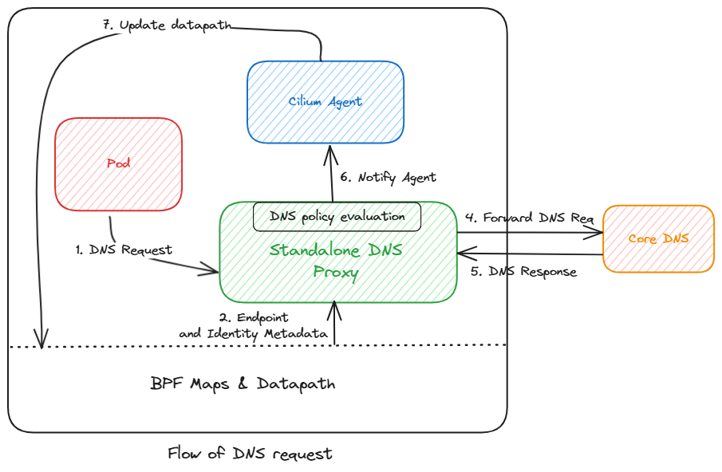

# CFP-30984: toFQDN DNS proxy HA

**SIG: SIG-POLICY**

**Begin Design Discussion:** 2024-04-08

**Cilium Release:** 1.17

**Authors:** Hemanth Malla <hemanth.malla@datadoghq.com>, Vipul Singh <singhvipul@microsoft.com>

## Summary

Cilium agent uses a proxy to intercept all DNS queries and obtain necessary information for enforcing toFQDN network policies. However, the lifecycle of this proxy is coupled with cilium agent. When an endpoint has a toFQDN network policy in place, cilium installs a redirect to capture all DNS traffic. So, when the agent is unavailable all DNS requests time out, including when DNS name to IP address mappings are already in place for this name.DNS policy unload on shutdown can be enabled on agent, but it works only when L7 policy is set to * and agent is shutdown gracefully.

This CFP introduces a standalone DNS proxy that can be run alongside cilium agent which should eliminate the hard dependency on cilium agent atleast for names that are already resolved.

## Motivation

Users rely on toFQDN policies to enforce network policies against traffic to remote destinations outside the cluster, typically to blob storage / other services on the internet. Rolling out cilium agent should not result in traffic being dropped. Introducing a high availablility (HA) mode will allow for adoption of toFQDN network policies in critical environments.

## Goals

* Introduce a streaming gRPC API for exchanging FQDN related policy information.
* Introduce standalone DNS proxy (SDP) that binds on the same port as built-in proxy with SO_REUSEPORT and uses the above mentioned API to notify agent of new DNS resolutions.
* Leverage the bpf maps to resolve IP address to endpoint ID and identity ID for enforcing L7 DNS policy.

## Non-Goals

* Updating new DNS <> IP mappings when agent is down is out of scope

## Proposal

### Overview



There are two parts to enforcing toFQDN network policy. L4 policy enforcement against IP adresses resolved from a FQDN and policy enforcement on DNS requests (L7 DNS policy). In order to enforce L4 policy, per endpoint policy bpf maps need to be updated. We'd like to avoid multiple processes writing entries to policy maps, so the standalone DNS proxy (SDP) needs a mechansim to notify agent of newly resolved FQDN <> IP address mappings. This CFP proposes exposing a new gRPC streaming API from cilium agent to do this. Cilium agent can re-use the same connection to notify the SDP of L7 DNS policy changes. Additionally SDP also needs to translate IP address to endpoint ID and identity in order to enforce policy by reusing the logic from agent's DNS proxy. Our proposal involves retrieving the endpoint and identity data directly from the `cilium_lxc` and `cilium_ipcache` BPF maps, respectively.

### RPC Methods

Method : UpdateMappings

`_rpc UpdatesMappings(steam FQDNMapping) returns (Result){}_`

Request :

```proto
message FQDNMapping {
    string FQDN = 1;
    repeated bytes IPS = 2;
    int32 TTL = 3;
    bytes client_ip = 4;
    int32 response_code = 5;
}
```

Response :

```proto
message Result {
    bool success = 1;
}
```

Method : UpdatesDNSRules

`_rpc UpdatesDNSRules(Request) returns (stream DNSPolicyRules){}_`

Request :

```proto
message Result {
    message string = 1;
}
```

Response :

```proto
message FQDNSelector {
  string match_name = 1;
  string match_pattern = 2;
}

message DNSPolicyRule {
  string selector_string = 1;
  repeated FQDNSelector port_rules= 2;
  repeated string match_labels = 3;
  repeated uint32 selections = 4;
}

message DNSPolicyRules {
  uint64 endpoint_id = 1;
  uint32 port = 2;
  repeated DNSPolicyRule rules = 3;
}
```

### Tracking policy updates to SDP instances

Since SDP can be deployed out of band and users can choose to completely disable built-in proxy to run multiple instances of SDP, agent should be prepared to handle multiple instances. In order to ensure all instances  have upto date policy revisions, agent will maintain a mapping of ACKed policy revision numbers against stream ID.
Since policy revision numbers from Cilium are reset when the local Cilium instance restarts, we need to unconditionally send the policy updates to the SDP instance on agent restart.

## Impacts / Key Questions

### Getting the DNS Rules

We need the DNS Rules for the Standalone DNS proxy to enforce the L7 DNS policy. The policy are the source of turth for the rules and are propagated to the agent when we apply the policy. We explore the options to get the DNS rules for the DNS proxy.

#### Option 1: Running the GRPC sever in the agent[Recommended]

We can run a gRPC server in the agent to serve the DNS rules to the DNS proxy. SDP will be responsible for creating the connection with the agent. And once SDP establish a connection agent can keep track of the stream and send the DNS rules to the SDP. Agent can then reuse the same stream to send updates in the DNS rules.
In case, cilium agent is still not up, SDP will keep trying to connect to the agent until the connection is established.

Pros

* SDP instances has the responsibility to connect to the agent.
* Reusing the same stream will be effiecient in terms of resources as we are not creating/destroying the stream for every update.

Cons

* An overhead on the cilium agent to keep track of the streams of the connected SDP instances.
* Streams are not thread safe, so if we have multiple threads using the same stream we will need to handle the synchronization.
* If SDP in future decides to handle policy updates as well, it will be trick. SDP needs to keep trying to sync with CA as well as CA needs to keep a track of the SDP instances to send updates.


#### Option 2: Running the GRPC server in the SDP as well

SDP can also runs a grpc server so that the agent can send the DNS rules to the SDP when the rules are ready instead of keeping alive the stream. On startup/restart SDP follows the same pattern as that of single grpc server, it asks for DNS rules from Cilium agent. For policy updates, agent just sends the data to server running at SDP.

Pros

* No overhead on the agent to keep a track of the open streams with the SDP.
* Better fault isolation(one stream failing does not affect the other streams)

Cons

* Resource intensive as we are creating a new stream for every update.
* If multiple SDP instance are running, we need to handle multiple grpc server on same address:port and send updates to each server froma agent.

#### Option 3: Reading the ep_config.json file in the SDP

We can read the DNS rules from the `ep_config.json` file. SDP will listen on the changes to the file and update the DNS rules accordingly. Cilium agent is the only one that writes to the file. Currently DNS rules are stored in the ep_config.json lazily as we only need those when DNS proxy restarts. We need to make sure that the DNS rules are updated in the file as soon as the policy is applied.
Storing the dns rules will require identities associated with the selector labels as current dns proxy implementation uses that to filter the DNS traffic OR will need to change the way dns porxy filters the DNS requests.

Pros

* No need to run a gRPC server in the agent/SDP.
* Removes the dependency on the agent to get the DNS rules.

Cons

* Will change the current implmentation/flow of flitering the dns requests.
* Reading a file might not be as efficient as reading from a gRPC server.

### Q : Why did we choose grpc option over reading from filesystem?

The main reason to choose the grpc option is that current implementation updates the DNS rules lazily(not when the policy is applied). So we cannot depend on the file system to provide us the current DNS rules. In order to read from the filesystem, we need to make sure that the DNS rules are updated in the file as soon as the policy is applied. This will require a change in the current implementation of the DNS proxy. Also, reading from the filesystem might not be as efficient as reading from a grpc server.

### Discovering endpoint metadata from SDP

In order to enforce L7 DNS policy, SDP needs to translate IP address to endpoint ID and identity ID. The simplest option is to reuse the same gRPC stream and implement another method to get the mappings from cilium agent. Since the actual source of truth are the bpf maps. And SDP is expected to resolve the DNS queries even when agent is down, it is better to read the information directly from the bpf maps. We choose the bpf option as it is more reliable and does not rely on agent availability. It also aligns with having a HA DNS proxy.

#### Option 1a: gRPC method

Get the endpoint ID and identity for a given IP address by making a gRPC call to cilium agent.

Pros

* Avoid interacting with low-level details. Simpler to maintain and stay upto date with any datapath changes.
* All data can be cached in-memory, in an event of agent being unavailable, SDP can lookup from in-memory cache

Cons

* Reliance on gRPC call in the hot-path
* Does not cache the data for endpoints that never had a DNS query.
* In an event where SDP restarts when agent's gRPC service is unavailable, all cached state is lost and SDP cannot translate IP to endpoint ID or identity.

#### Option 1b: Listen to ipcache updates via grpc

Similar to envoy, SDP can listen to ipcache updates and maintain a local cache of IP to endpoint ID mappings via grpc. This changes the way DNS proxy currently behaves i.e pull based model to push based model.

Pros

* Simpler to maintain and stay upto date with any new ip<>identity changes.
* All data can be cached in-memory, in an event of agent being unavailable, SDP can lookup from in-memory cache

Cons

* Need a method for reconciling the cache in case of SDP restarts.
* SDP will be aware of all the endpoints data, which might not be needed for DNS proxy.

#### Option 2: Read from bpf maps [Recommended]

We will need to read from couple of bpf maps to get the endpoint ID and identity for a given IP address. For ip to endpoint ID, we can read from `cilium_lxc` and for ip to identity, we can read from `cilium_ipcache`.

Pros

* Reduced resource utilization in agent since agent doesn't need to process rpc calls in hotpath
* IP to endpoint ID or identity translation does not rely on agent availability.
* DNS can be resolved even when agent is down.

Cons

* Low level interactions from components external to cilium agent.

### Q: Why did we choose to read from bpf maps ?

The reason we chose to read from bpf maps is because the DNS proxy should be able to resolve the DNS queries even when agent is down. The bpf maps are the source of truth for cilium agent and are updated in real time. So, reading from bpf maps ensures that the DNS proxy is always in sync with the cilium agent.

### Flag to disable built-in proxy

Adding a flag(`--disable-builtin-dns-proxy`) to cilium agent to disable the built in dns proxy allows standlone dns proxy to run its independent lifecycle.

#### Pros

* Allows cilium agent to be upgraded without breaking the DNS traffic.
* Provides a freedom to allow any delegated dns proxy to be plugged in.
* Reduces the resource utilization in cilium agent.

#### Cons

* Higher latency in DNS resolution as the DNS queries are now handled by a separate process.

### Q: Restoring L7 DNS policy when agent is unavailable

In an event where SDP restarts when agent's gRPC service is unavailable. SDP can read from the filesystem and restore the policy. The state is stored in `ep_config.json` file. So the flow would be first trying to connect to agent and if it fails, read from the file.

### Scenarios and Expected Behaviour

In an ideal scenario, both cilium agent and SDP should be interacting with each other through a biredirectional grpc stream. However, in an event where either of them restarts/upgrade/donwgrade, what should be the expected behavior ?

#### Cilium Agent is down, SDP is running

* SDP should be able to serve DNS queries based on the existing bpf maps and in memory DNS rules. The datapath of already configured policies will work. Any new mappings will not be updated until cilium agent is back up.
* In case SDP restarts while cilium agent is down, the SDP should be able to read the rules from the filesystem and restore them.

#### Cilium Agent is running, SDP is down/restarting

* In case Cilium Agent has the DNS proxy running as well, then DNS queries will be served.
* Once SDP is starting up, it will connect to the agent and get the latest policy updates.

#### SDP Upgrade(Given Cilium Agent is Running)

* Cilium agent can keep serving the DNS queries through in built DNS proxy. In case, the inbult dns proxy is disabled, the SDP needs an upgrade path. This can be achieved using the `maxsurge` on the sdp. Adding this as a future milestone.

| Agent | Builtin DNS Proxy | SDP | Datapath | DNS |
|-------|-------------------|-----|----------|-----|
| Running | Disabled | Running | Works | Works |
| Running | Running | Down | Works  | Works |
| Running | Running | Running | Works  | Works |
| Running | Down | Down | Works | Does not works |
| Down | Down | Running | Datapath should work too if already configured. | Works for already configured policy |

### Permissions to access the BPF maps

Since SDP needs to read from the bpf maps, it needs to have the necessary permissions to access the bpf maps. Permissions needed are `CAP_SYS_ADMIN` and `CAP_BPF`. [Need to verify if the permissions are dependent on linux distribution.]

## Future Milestones

* Plumb toFQDN policy for new names when agent is unavailable
* The upgrade scenario of SDP.
